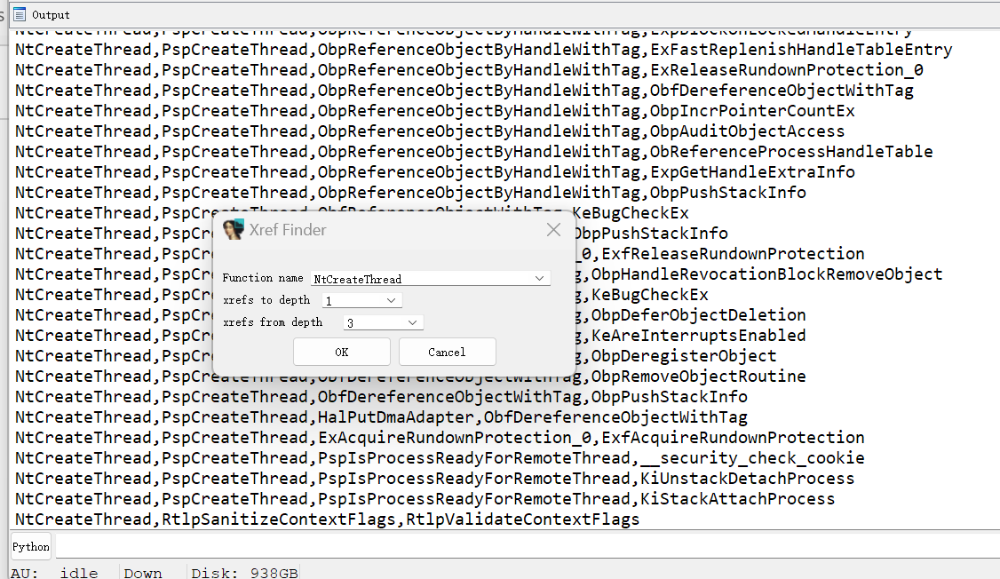
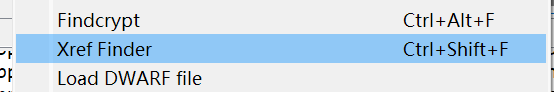
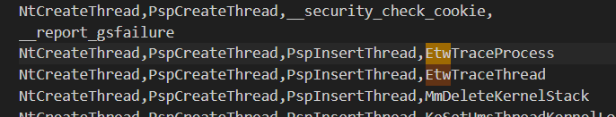

# find_xrefs
ida script for printing xrefs function call chains.

# Install

copy find_xrefs.py to ida plugin directory.

# Why

User xrefs chart is good, why write a plugin with the same function?

Because graphical display is inconvenient for text search.

Using find_xrefs, find xrefs for NtCreateThread, i can quickly find where it calls etw logging:

